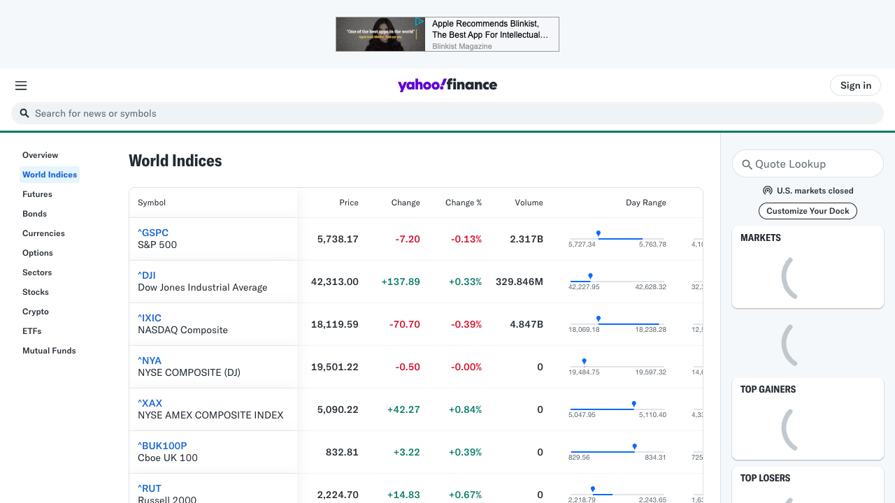

# World Indices Scraper

This project is a web scraping tool built with Bun and Playwright to fetch and format world stock indices data from Yahoo Finance.

<p align="center">
  
</p>

## Features

- Scrape data from Yahoo Finance World Indices page
- Formats the data into a clean JSON structure
- Uses Playwright for reliable web scraping
- Implements user agent randomization for better request handling

## Prerequisites

Before you begin, ensure you have met the following requirements:
- You have installed [Bun](https://bun.sh) (v1.1.27 or later)
- You have a basic understanding of TypeScript and web scraping concepts

## Installation

follow these steps:

1.  To install dependencies:

```bash
bun install
```

2. To run:

```bash
bun run start
```

This project was created using `bun init` in bun v1.1.27. [Bun](https://bun.sh) is a fast all-in-one JavaScript runtime.
